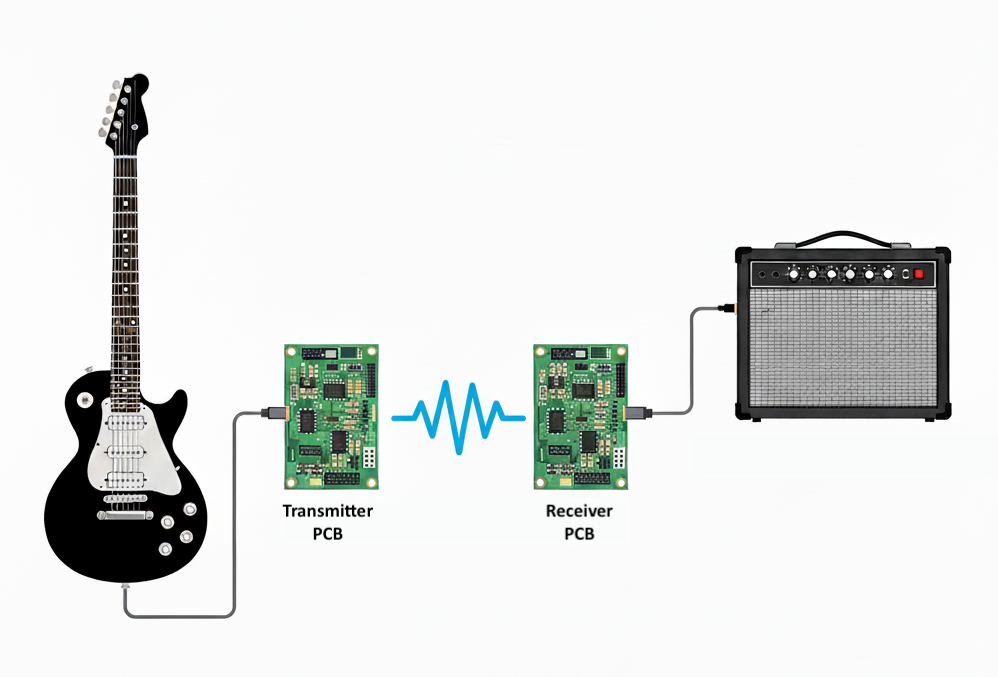
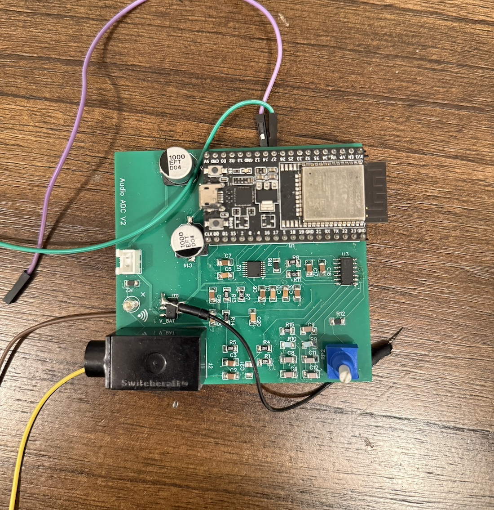

## Wireless Audio Transmitter

<figure style="text-align:center">
  
  <figcaption>System Diagram</figcaption>
</figure>
  

This repo is one half of a wireless audio streaming system between two ESP32s.The code here specifically implements the transmitting side of the wireless system. The goal of this repo and the [receiving side](https://github.com/rahulahooper/wireless-audio-receiver/tree/main) of the wireless system is to stream audio from a guitar to an amplifier without having a physical cable between the two. 

The transmitter software consists of two parallel threads (or tasks, in FreeRTOS lingo): the sampling task and the transmit task. 

The sampling task, as its name implies, is responsible for sampling data from a guitar. It specifically interfaces with a [PCM4201](https://www.ti.com/product/PCM4201) analog-to-digital converter (DAC), which communicates over [I2S](https://docs.espressif.com/projects/esp-idf/en/stable/esp32/api-reference/peripherals/i2s.html). The transmit task, on the other hand, is responsible for setting up the Wifi connection with and sending audio data to the receiving ESP32. The task does so using a UDP connection over Wifi. As mentioned before, the two tasks run in parallel, on separate cores. By splitting the sampling and the transmit tasks into two separate threads, we ensure that the software doesn't miss any audio data coming from the ADC.

### Task Synchronization

The two tasks exchange data with one another using [double-buffering](https://wiki.osdev.org/Double_Buffering). The idea is that the sampling task places audio data into a "background packet" while the transmit task simultaneously streams an "active packet" to the receiving ESP32. These two packets are used to avoid contention between the two tasks. That is, the two tasks are always operating on separate packets, never on the same one. When the transmit task successfully sends the active packet to the receiving ESP32, it signals to the sampling task that it needs new data. The sampling task, which periodically polls for this signal, swaps the background and active packets, then signals to the transmit task that new data is available.  

### Circuit

<figure style="text-align:center">
  
  <figcaption>The circuit board, with some debug wires soldered</figcaption>
</figure>
  

The schematic and layout of the audio transmitter are included in the repo. The circuit is responsible for receiving audio data from a guitar, filtering it, converting it into a differential signal, then sending the differential signal to the PCM4201 ADC.

The circuit requires a little bit more work, as it exhibits a low overall power supply rejection. Specifically, whenever the ESP32 transmits an audio packet, there is a noticeable drop in the 5V supply rail, which powers pretty much everything on the board. As the ESP32 transmits data at a regular interval of 5ms (200Hz), this drop in the 5V rail actually introduces a noticeable 200Hz hum into the audio.

I added some 1mF capacitors to the 5V rail near the ESP32. This has improved the power supply rejection of the audio circuit, but hasn't completely fixed the problem and isn't a great solution. The board is powered off of a 9V battery, which feeds into a 5V linear drop-out regulator (LDO). It's possible that selecting an LDO with a faster response to load fluctuations will fix the problem for good.

The circuit also consumes power like crazy, making it impractical to power the board off of 9V for extended periods of time. I haven't made any direct measurements but I suspect that the WiFi is consuming the most power. While there are some optimizations to make in the softare to make the WiFi less power hungry, a low-hanging fruit in the hardware is the LDO. The LDO converts the battery's 9V supply rail to 5V, which itself gets regulated down to 3.3V by the ESP32. This means that 9V - 3.3V = 5.7V provided by the battery are dissipated as heat. 
